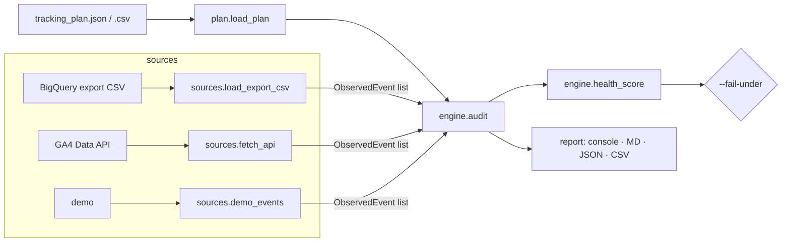

# ga4audit — GA4 Event Auditor

[](tests/test_audit.py)
[](https://python.org)
[](LICENSE)
[](pyproject.toml)

> Validate what GA4 is *actually* collecting against the tracking plan you agreed with the client — from a BigQuery export, the GA4 Data API, or a demo set — and get a health score you can gate a release on.

```
ga4audit --plan tracking_plan.json --events ga4_export.csv --fail-under 80

GA4 Event Audit — ga4_export.csv
Source: export   Plan events: 5
━━━━━━━━━━━━━━━━━━━━━━━━━━━━━━━━━━━━━━━━━━━━━━━━━━━━━━━━

✅ PASSING (1/5)
  view_item                  2,866

⚠️  PARAMETER ISSUES (2/5)
  purchase                   1,247  partial: currency (50%)
  begin_checkout               892  missing: currency

❌ NOT FIRING (1/5)
  generate_lead            0 occurrences

🏷️  NAMING ISSUES (1)
  Generate_Lead                 44  → should be generate_lead

👻 GHOST EVENTS — firing but not in plan (1)
  checkout_start               211

━━━━━━━━━━━━━━━━━━━━━━━━━━━━━━━━━━━━━━━━━━━━━━━━━━━━━━━━
Health score: 61/100
```

## The Problem

GA4 implementations break silently. A GTM container gets republished, a CMS update renames a data-layer key, a developer ships `Generate_Lead` instead of `generate_lead` — and nobody notices until the monthly report shows conversions down 40%. DebugView tells you what *one* session is doing right now; it says nothing about whether `purchase` carried `currency` on 100% of last month's transactions or on 50% of them.

## The Solution

`ga4audit` compares observed events with a tracking plan and reports four things per event: is it firing, is it firing *enough*, are its required parameters populated (with a coverage percentage, not a yes/no), and is anything firing that shouldn't be. It replaces two earlier single-file tools:

| Capability | v1 `ga4-event-auditor` (Python) | `ga4-event-tracking-auditor` (Node) | **ga4audit v2** |
|---|---|---|---|
| Source | GA4 Data API only | BigQuery CSV only | **API, BigQuery long/wide CSV, or demo** |
| Parameter checks | hard-coded demo | present/absent | **coverage % per parameter; API "unverifiable" state** |
| Naming drift (`Add_To_Cart`) | yes | no | yes (snake/camel/kebab aware) |
| Ghost events | no | yes | yes, with GA4 auto-event allow-list |
| Minimum volume | no | yes | yes |
| Output | console + CSV | MD + JSON | **console + MD + JSON + CSV, `--fail-under` exit code** |
| Tests | none | none | 10 |

## Features

- One tracking plan format for both sources — accepts `name` **or** `event_name`, JSON **or** CSV, so plans from either predecessor load unchanged
- BigQuery flat export (`UNNEST(event_params)` long format) parsed into real per-occurrence parameter coverage, using `event_timestamp` + `user_pseudo_id` to identify an event
- Wide-format exports (DebugView / GTM preview / spreadsheets) with an optional `event_count` column
- GA4 Data API mode queries `customEvent:<param>` dimensions per required parameter; parameters that are not registered as custom dimensions are reported as *unverifiable* instead of being faked (v1 silently hard-coded this)
- `--coverage-threshold` separates *missing* (0%) from *partial* (< 95% by default) parameters
- Naming-drift detection maps `Add_To_Cart`, `add-to-cart`, `addToCart` back to the planned `add_to_cart`
- Ghost-event detection ignores GA4 auto-collected / Enhanced Measurement events and `gtm.*`
- Health score 0–100 with partial credit per parameter and a penalty for naming drift
- `--fail-under N` exit code for CI or a pre-launch checklist

## Architecture



`sources.py` turns any input into a list of `ObservedEvent(name, count, param_counts)`. `engine.py` is pure and file-free, so it is fully unit-tested against fixtures; the API client is the only optional dependency.

## Tech Stack

- Python 3.10+, stdlib only for export/demo mode
- Optional: `google-analytics-data`, `google-auth` (`pip install "ga4audit[api]"`)
- Testing: `pytest`; lint: `ruff`

## Installation

```bash
git clone https://github.com/mehranmoghadasi/ga4-event-auditor.git
cd ga4-event-auditor
pip install -e ".[dev]"        # export + demo mode
pip install -e ".[api,dev]"    # add GA4 Data API mode
ga4audit --version
```

## Usage

**Tracking plan** (`examples/tracking_plan.json`)

```json
{
  "property_id": "123456789",
  "events": [
    { "event_name": "purchase", "required_parameters": ["transaction_id", "value", "currency", "items"], "optional_parameters": ["coupon"], "expected_minimum_count": 50 },
    { "event_name": "generate_lead", "required_parameters": ["form_id", "form_name"], "expected_minimum_count": 20 }
  ]
}
```

**1. Audit a BigQuery export**

```sql
-- Export this from BigQuery as CSV
SELECT event_date, event_timestamp, user_pseudo_id, event_name,
       ep.key AS event_params_key,
       ep.value.string_value AS event_params_value_string_value,
       ep.value.int_value AS event_params_value_int_value,
       ep.value.double_value AS event_params_value_double_value
FROM `project.analytics_123456789.events_*`, UNNEST(event_params) ep
WHERE _TABLE_SUFFIX BETWEEN '20260801' AND '20260831'
```

```bash
ga4audit --plan tracking_plan.json --events ga4_export.csv --output ./audit --fail-under 80
```

**2. Audit straight from the GA4 Data API**

```bash
ga4audit --plan tracking_plan.json --source api --credentials service-account.json --days 30
```

Create a service account with *Viewer* access to the property. For parameter checks to be verifiable, each required parameter must be registered as an event-scoped custom dimension in GA4 Admin → Custom definitions; otherwise it is listed as *unverifiable*.

**3. Try it without data**

```bash
ga4audit --plan examples/tracking_plan.json --source demo
```

## Sample Output

`audit/audit_report.md`

| Event | Status | Occurrences | Details |
|---|---|---:|---|
| `purchase` | param_issues | 1,247 | partial: currency (50%) |
| `add_to_cart` | below_expected | 180 | expected ≥ 200 |
| `begin_checkout` | param_issues | 892 | missing: currency |
| `generate_lead` | missing | 0 | |

`audit/audit_report.csv` adds `naming_issue` and `ghost` rows; `audit/audit_report.json` carries the full structured result for dashboards.

## Related Projects

- [gsc-coverage-monitor](https://github.com/mehranmoghadasi/gsc-coverage-monitor) — the Search Console counterpart: catches indexing regressions the same way this catches tracking regressions
- [agency-report-builder](https://github.com/mehranmoghadasi/agency-report-builder) — feed `audit_report.json` in as a data-quality section
- Superseded: [ga4-event-tracking-auditor](https://github.com/mehranmoghadasi/ga4-event-tracking-auditor) — its BigQuery parsing, ghost detection, and minimum-volume checks now live here

## Roadmap

1. Parameter *value* validation (type and allowed-values rules in the plan)
2. Measurement Protocol replay to reproduce a failing event
3. GTM container export cross-check (tag → event mapping)
4. Slack / email summary via `--notify`
5. Trend mode: diff two audits and flag regressions

## Project Structure

```
ga4-event-auditor/
├── src/ga4audit/
│   ├── models.py     # PlanEvent, ObservedEvent, findings, AuditReport
│   ├── plan.py       # JSON/CSV tracking-plan loader (both legacy key styles)
│   ├── sources.py    # BigQuery long/wide CSV, GA4 Data API, demo
│   ├── engine.py     # audit + canonical naming + health score
│   ├── report.py     # console / Markdown / JSON / CSV renderers
│   └── cli.py
├── tests/            # pytest suite + fixtures
├── examples/         # tracking plan + BigQuery-shaped export
└── pyproject.toml
```

## Contributing

PRs welcome — especially real BigQuery export shapes and edge cases in GA4 naming.

## License

MIT — see [LICENSE](LICENSE).

## About the Author

**Mehran Moghadasi** — Digital Marketing & Brand Manager (SEO · Google Ads · Meta Ads · Social Media), Calgary, AB. 13+ years turning analytics into decisions for service, e-commerce, and professional-services clients.
[github.com/mehranmoghadasi](https://github.com/mehranmoghadasi) · [linkedin.com/in/mehranmoghadasi](https://www.linkedin.com/in/mehranmoghadasi)
